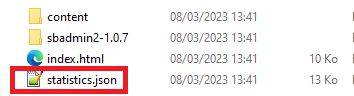
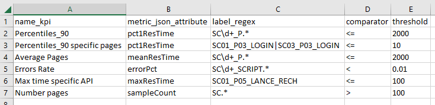
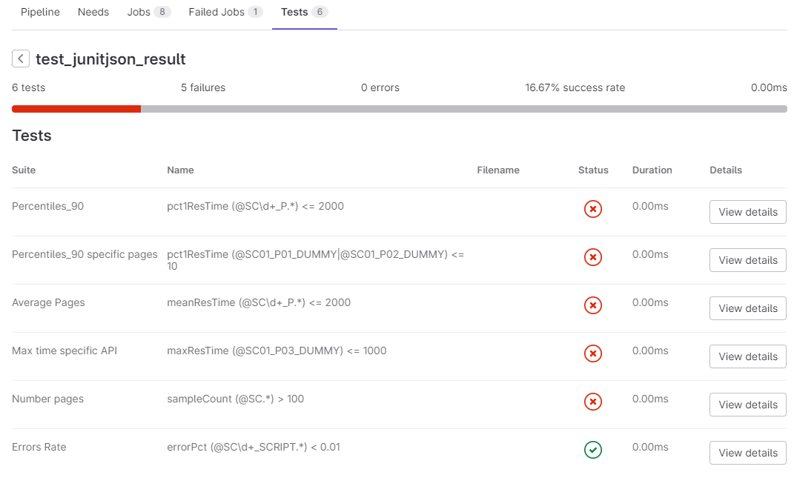
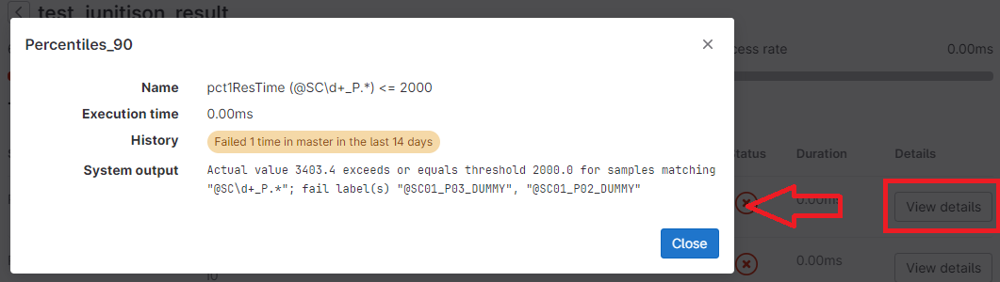
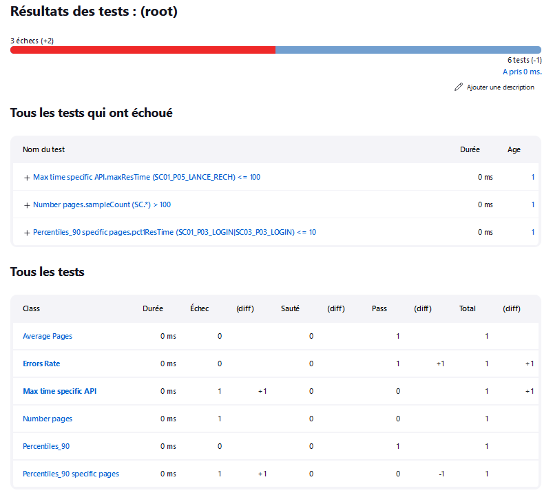
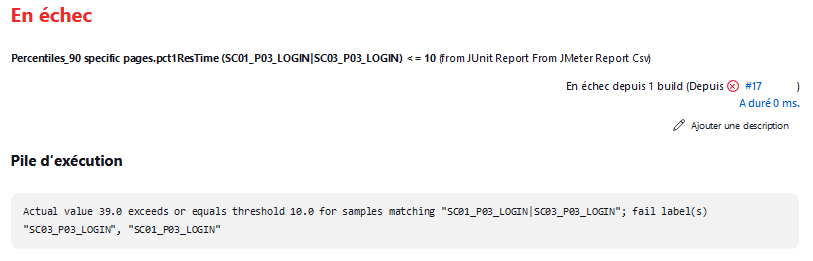
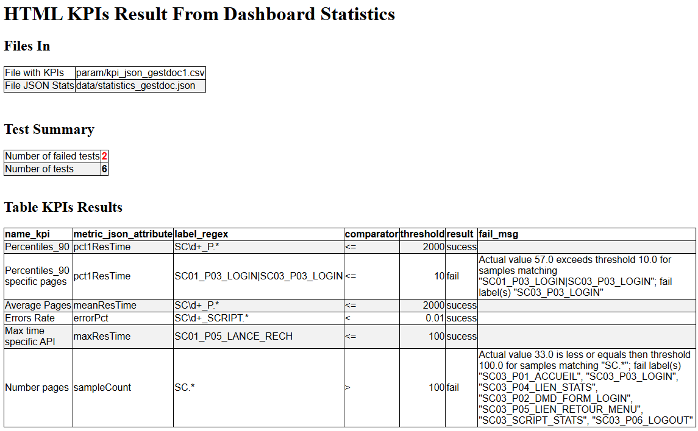
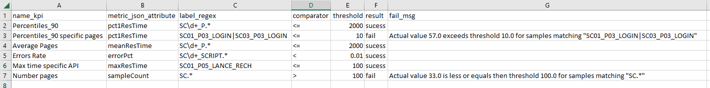
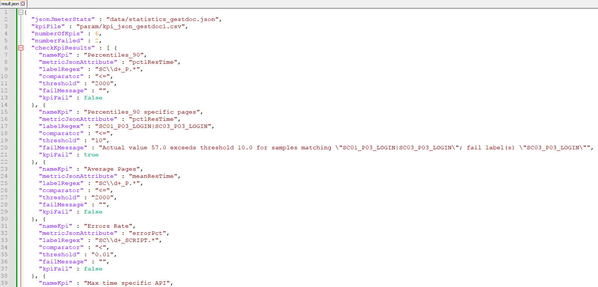

# Generating JUnit Report based on custom Key Performance Indicators (KPIs) applied to the JMeter Dashboard Statistics Json file

This tool read KPI declarations in a file and apply the KPI assertion on a JMeter Dashboard Statistics Json file and generates a result file in JUnit XML format and others formats Html, Json and Csv.

[Manual Dashboard](https://jmeter.apache.org/usermanual/generating-dashboard.html#report)
JMeter Dashboard Statistics Json file could be generated in Command Line Interface (CLI) with :
- Generation from an existing sample CSV log file
  - jmeter -g &lt;log file&gt; -o &lt;Path to output folder&gt;
  - jmeter -g &lt;log file&gt; -o &lt;Path to output folder&gt; -Jjmeter.reportgenerator.exporter.html.series_filter="SC[0-9]+_.*" -Jjmeter.reportgenerator.overall_granularity=4000 (with filter and granularity parameters)
- Generation after load test
  - jmeter -n -t &lt;test JMX file&gt; -l &lt;test log file&gt; -e -o &lt;Path to output folder&gt;

The JMeter Dashboard Json file statistics.json is created in the &lt;Path to output folder&gt;<br>



## The KPI file format
The KPI file needs 5 columns :
1) name_kpi the name of the KPI also the classname in the Test Case in JUnit
2) metric_json_attribute the attribute name in the statistics.json file (**Attributes** are : `sampleCount` or `errorCount` or `errorPct` or `meanResTime` or `medianResTime` or `minResTime` or `maxResTime` or `pct1ResTime` (90 percentile) or `pct2ResTime` (95 percentile) or `pct3ResTime` (99 percentile) or `throughput` or `receivedKBytesPerSec` or `sentKBytesPerSec`)
3) label_regex the Label name in regular expression, the transaction attribute in the JMeter Dashboard statistics.json file (E.g : `SC01_P.*` or `SC\d+_P.*` or `SC01_P01_LOGIN` or `SC01_P01_LOGIN|SC01_P02_HOME` or `\d+ /.*` )
4) comparator the comparator `<` or `<=` or `>` or `>=`
5) threshold the value (for percentage rate `errorPct` use value between 0 and 1, e.g : 0.02 for 2%)

The column separator is ',' for the kpi file
<pre>
name_kpi,metric_json_attribute,label_regex,comparator,threshold
Percentiles_90,pct1ResTime,SC\d+_P.*,<=,2000
Percentiles_90 specific pages,pct1ResTime,SC01_P03_LOGIN|SC03_P03_LOGIN,<=,10
Average Pages,meanResTime,SC\d+_P.*,<=,2000
Errors Rate,errorPct,SC\d+_SCRIPT.*,<,0.01
Max time specific API,maxResTime,SC01_P05_LANCE_RECH,<=,100
Number pages,sampleCount,SC.*,>,100
</pre>

KPI View in Excel<br>


Save in UTF-8 comma separator **no BOM** or csv with comma separator if you have only ASCII characters (no accent é,è, à ...)

## Parameters 
The tool have parameters :
<pre>
usage: io.github.vdaburon.jmeter.utils.jsonkpi.JUnitReportFromJMDashboardStats [-csvOutFile &lt;csvOutFile&gt;] [-divHtmlOutFile &lt;divHtmlOutFile&gt;]
       [-exitReturnOnFail &lt;exitReturnOnFail&gt;] [-help] [-htmlOutFile &lt;htmlOutFile&gt;] [-jsonOutFile &lt;jsonOutFile&gt;] -jsonStats &lt;jsonStats&gt;
       [-junitFile &lt;junitFile&gt;] -kpiFile &lt;kpiFile&gt;
io.github.vdaburon.jmeter.utils.jsonkpi.JUnitReportFromJMDashboardStats
 -csvOutFile &lt;csvOutFile&gt;               Csv out file result optional (E.g: result.csv)
 -divHtmlOutFile &lt;divHtmlOutFile&gt;       Div Partial Html Page out file result optional (E.g: div_result.html), to include in an another HTML
                                        Page
 -exitReturnOnFail &lt;exitReturnOnFail&gt;   if true then when kpi fail then create JUnit XML file and program return exit 1 (KO); if false
                                        [Default] then create JUnit XML File and exit 0 (OK)
 -help                                  Help and show parameters
 -htmlOutFile &lt;htmlOutFile&gt;             Html out file result optional (E.g: result.html)
 -jsonOutFile &lt;jsonOutFile&gt;             Json out file result optional (E.g: result.json)
 -jsonStats &lt;jsonStats&gt;                 JMeter Dashboard stats file (E.g : statistics.json)
 -junitFile &lt;junitFile&gt;                 junit file name out (Default : jmeter-junit-plugin-jmstats.xml)
 -kpiFile &lt;kpiFile&gt;                     KPI file contains rule to check (E.g : kpi.csv)
E.g : java -jar junit-reporter-kpi-from-jmeter-dashboard-stats-&lt;version&gt;-jar-with-dependencies.jar -jsonStats statistics.json  -kpiFile
kpi.csv -exitReturnOnFail true
or more parameters : java -jar junit-reporter-kpi-from-jmeter-dashboard-stats-&lt;version&gt;-jar-with-dependencies.jar -jsonStats statistics.json
-kpiFile kpi_check.csv -junitFile junit.xml -htmlOutFile result.html -divHtmlOutFile div_result.html -csvOutFile result.csv -jsonOutFile
result.json -exitReturnOnFail false
</pre>

## JUnit Report XML file generated
Example JUnit XML file generated :
```xml
<?xml version="1.0" encoding="UTF-8" standalone="no"?>
<testsuite errors="0" failures="2" name="JUnit Report From Dashboard Statistics" skipped="0" tests="6">
  <testcase classname="Percentiles_90" name="pct1ResTime (SC\d+_P.*) &lt;= 2000"/>
  <testcase classname="Percentiles_90 specific pages" name="pct1ResTime (SC01_P03_LOGIN|SC03_P03_LOGIN) &lt;= 10">
    <failure message="">Actual value 57.0 exceeds or equals threshold 10.0 for samples matching "SC01_P03_LOGIN|SC03_P03_LOGIN"; fail label(s) "SC03_P03_LOGIN"</failure>
  </testcase>
  <testcase classname="Average Pages" name="meanResTime (SC\d+_P.*) &lt;= 2000"/>
  <testcase classname="Errors Rate" name="errorPct (SC\d+_SCRIPT.*) &lt; 0.01"/>
  <testcase classname="Max time specific API" name="maxResTime (SC01_P05_LANCE_RECH) &lt;= 100"/>
  <testcase classname="Number pages" name="sampleCount (SC.*) &gt; 100">
    <failure message="">Actual value 33.0 is less then threshold 100.0 for samples matching "SC.*"; fail label(s) "SC03_P01_ACCUEIL", "SC03_P03_LOGIN", "SC03_P04_LIEN_STATS", "SC03_P02_DMD_FORM_LOGIN", "SC03_P05_LIEN_RETOUR_MENU", "SC03_SCRIPT_STATS", "SC03_P06_LOGOUT"</failure>
  </testcase>
</testsuite>
```
Remark : failure message is limited to 1024 characters, if failure message finished with "..." then the message is voluntarily truncated.

## JUnit Report in a Gitlab Pipeline
A JUnit Report with KPIs display in a Gitlab Pipeline<br>


If you click on button "View Details" for Status Fail, you will show the fail message<br>


## JUnit Report in Jenkins Build
A JUnit Report with KPIs display in Jenkins Build<br>


If you click on link "Name Test" fail , you will show the fail message<br>


## Html out format
The result could be a html page ou partial html page (div)


## Csv out format
The result in a csv file


## Json out format
The result in a Json file


## License
See the LICENSE file Apache 2 [https://www.apache.org/licenses/LICENSE-2.0](https://www.apache.org/licenses/LICENSE-2.0)

## Usage Maven
The maven groupId, artifactId and version, this plugin is in the **Maven Central Repository** [](https://maven-badges.herokuapp.com/maven-central/io.github.vdaburon/junit-reporter-kpi-from-jmeter-dashboard-stats)

```xml
<groupId>io.github.vdaburon</groupId>
<artifactId>junit-reporter-kpi-from-jmeter-dashboard-stats</artifactId>
<version>1.4</version>
```
Just include the plugin in your `pom.xml` and execute `mvn verify` <br>
or individual launch `mvn -DjsonStats=statistics.json -DkpiFile=kpi.csv -DjunitFile=jmeter-junit-plugin-jmstats.xml exec:exec@create_junit-report-kpi-from-jmeter-json-statics`

```xml

<project>
  <properties>
    <jsonStats>statistics.json</jsonStats>
    <kpiFile>kpi.csv</kpiFile>
    <junitFile>jmeter-junit-plugin-jmstats.xml</junitFile>
    <prefix_script_name>gestdoc</prefix_script_name>
  </properties>

  <dependencies>
    <dependency>
      <groupId>io.github.vdaburon</groupId>
      <artifactId>junit-reporter-kpi-from-jmeter-dashboard-stats</artifactId>
      <version>1.4</version>
    </dependency>
  </dependencies>

  <build>
    <plugins>
      <plugin>
        <groupId>org.codehaus.mojo</groupId>
        <artifactId>exec-maven-plugin</artifactId>
        <version>1.2.1</version>
        <executions>
          <execution>
            <!-- individual launch : mvn exec:exec@create_junit-report-kpi-from-jmeter-json-statics -->
            <id>create_junit-report-kpi-from-jmeter-json-statics</id>
            <phase>verify</phase>
            <goals>
              <goal>exec</goal>
            </goals>
            <configuration>
              <arguments>
                <argument>-classpath</argument>
                <!-- automatically creates the classpath using all project dependencies,
                                     also adding the project build directory -->
                <classpath/>
                <argument>io.github.vdaburon.jmeter.utils.jsonkpi.JUnitReportFromJMDashboardStats</argument>
                <argument>-kpiFile</argument>
                <argument>${project.build.directory}/jmeter/testFiles/${kpiFile}</argument>
                <argument>-jsonStats</argument>
                <argument>${project.build.directory}/jmeter/reports/${prefix_script_name}/${jsonStats}</argument>
                <argument>-junitFile</argument>
                <argument>${project.build.directory}/jmeter/results/${junitFile}</argument>
                <argument>-exitReturnOnFail</argument>
                <argument>true</argument>
              </arguments>
            </configuration>
          </execution>
        </executions>
      </plugin>
    </plugins>
  </build>
</project>
```

## Simple jar tool
This tool is a java jar, so it's could be use as simple jar (look at [Release](https://github.com/vdaburon/JUnitReportKpiJMeterDashboardStats/releases) to download jar file)
<pre>
java -jar junit-reporter-kpi-from-jmeter-dashboard-stats-&lt;version&gt;-jar-with-dependencies.jar -jsonStats statistics.json -kpiFile kpi.csv -junitFile junit-report.xml -exitReturnOnFail true
</pre>

## Tool installed with jmeter-plugins-manager 
This tool could be installed with the jmeter-plugins-manager from jmeter.plugins.org.<br>
The tool name is : "vdn@github - junit-reporter-kpi-from-jmeter-dashboard-stats tool"

in JMETER_HOME\bin (Windows)
<pre>
junit-reporter-kpi-from-jmeter-dashboard-stats.cmd -jsonStats statistics.json -kpiFile kpi.csv -junitFile junit-report.xml -htmlOutFile result.html -csvOutFile result.csv
</pre>
or <br>
in JMETER_HOME/bin (Linux or MacOS)
<pre>
junit-reporter-kpi-from-jmeter-dashboard-stats.sh -jsonStats statistics.json -kpiFile kpi.csv -junitFile junit-report.xml -htmlOutFile result.html -csvOutFile result.csv
</pre>

## Link to others projects 
Usually this plugin is use with [jmeter-maven-plugin](https://github.com/jmeter-maven-plugin/jmeter-maven-plugin) set `<generateReports>true</generateReports>` to generate the dashboard with `statistics.json` file.<br>

You could also use [jmeter-graph-tool-maven-plugin](https://github.com/vdaburon/jmeter-graph-tool-maven-plugin)

## Versions
version 1.4 add jmeter-plugins.org installer

version 1.3 export result in html, json or csv format

Version 1.2 change the Test Suite Name

Version 1.1 change Fail Message when equality

Version 1.0 initial version

